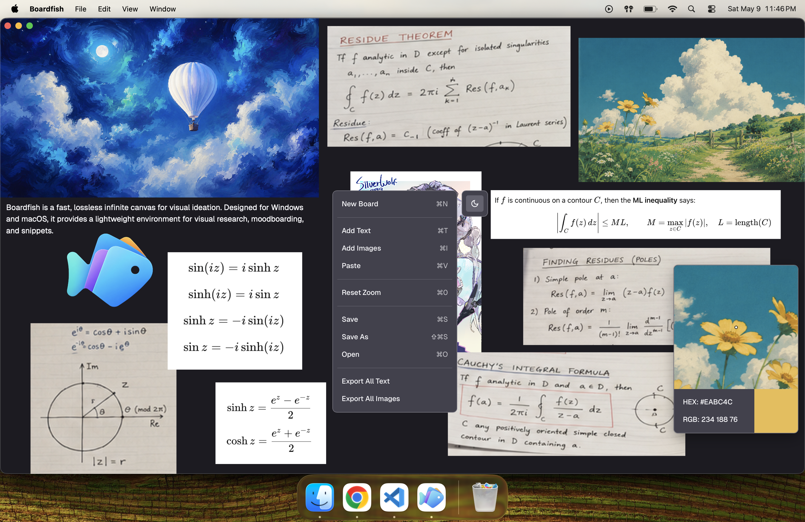

# Boardfish

[https://indominater.github.io/Boardfish/](https://indominater.github.io/Boardfish/)

Boardfish is a fast, lossless infinite canvas for visual ideation. It runs in the browser and provides a lightweight environment for visual research, moodboarding, and snippets.



## Features

- An infinite canvas free from formatting rules
- Lag-free navigation across massive boards supporting 500 MB of images and text
- Losslessly add images via clipboard, drag and drop, or the file picker
- Multi-select, translate, scale, flip, rotate, copy, paste, and duplicate
- Export one image, selected images, or all images
- Losslessly copy images back to your clipboard
- Save everything locally as a portable .bf file

## Keyboard Shortcuts

| Action | Mac | Windows |
|--------|-----|---------|
| New board | N | N |
| Open board | Cmd+O | Ctrl+O |
| Save | Cmd+S | Ctrl+S |
| Save As | Cmd+Shift+S | Ctrl+Shift+S |
| Add text | T | T |
| Add images | Cmd+I | Ctrl+I |
| Select all objects | Cmd+A | Ctrl+A |
| Add/remove object from selection | Cmd+click | Ctrl+click |
| Additive marquee selection | Cmd+drag empty canvas | Ctrl+drag empty canvas |
| Copy | Cmd+C | Ctrl+C |
| Cut | Cmd+X | Ctrl+X |
| Paste | Cmd+V | Ctrl+V |
| Duplicate selected | Cmd+D | Ctrl+D |
| Move selected to back | Cmd+[ | Ctrl+[ |
| Flip selected image(s) | Cmd+F | Ctrl+F |
| Rotate selected image(s) | Cmd+R | Ctrl+R |
| Export selected image(s) | Cmd+E | Ctrl+E |
| Undo | Cmd+Z | Ctrl+Z |
| Redo | Cmd+Shift+Z / Cmd+Y | Ctrl+Shift+Z / Ctrl+Y |
| Delete selected | Backspace / Delete | Backspace / Delete |
| Edit text | Double-click | Double-click |
| Pan canvas | Space + drag | Space + drag |
| Pan with wheel / trackpad | Scroll | Scroll |
| Zoom around cursor | Cmd+scroll | Ctrl+scroll |
| Reset zoom to nearest object | Cmd+0 | Ctrl+0 |
| Deselect / exit edit / close menus | Esc | Esc |

## Building from Source

```bash
git clone https://github.com/Indominater/Boardfish.git
cd Boardfish
npm install
npm run web:dev
```

For a production build, run:

```bash
npm run web:build
```

## License

Boardfish is source-available under the [Boardfish Source-Available License](LICENSE).

The source code is available for personal, educational, research, evaluation, and other non-commercial use. Commercial use, resale, redistribution as part of a paid product or service, and business/studio/enterprise use require prior written permission.
