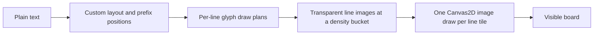
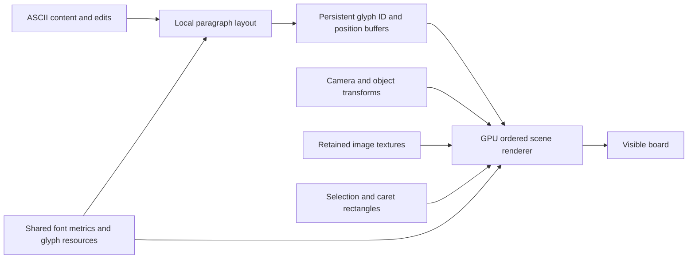

# ASCII text renderer: structural analysis

This is the pre-implementation analysis. The resulting default renderer and its
measured production-path results are described in [gpu-text-renderer.md](gpu-text-renderer.md).

September 6, 2026. Analysis of the working tree based on `e9204e5`, including the existing local edits. The production application was not modified for this study. The diagnostic prototype is isolated under `src/dev/`.

**Recommendation:** replace retained images of whole text lines with a retained GPU scene: one shared ASCII font resource, persistent glyph-position buffers, and ordered batches for text, images, selection, and caret. Keep the current plain-text document and input model. The quality-critical choice is how that shared font resource produces coverage at each screen size. Evaluate exact-size coverage masks at reading sizes and a scalable representation at larger sizes; do not mistake a fast fixed-scale atlas for a completed continuous-zoom solution.

**Concrete next implementation:** use a prebuilt MSDF atlas in the retained renderer to test continuous zoom, and use the measured exact-size coverage atlas as its small-text quality reference. Production adoption requires passing that comparison and the full zoom range. If MSDF fails the small-text gate, investigate predetermined hinted coverage sizes or analytic outline coverage. Resource selection must depend on scale and deliver the same quality in motion and at rest; rebuilding all fractional-phase masks on every new zoom value is not the selected design.

This is a change in representation and submission. It does not depend on horizontal text culling, omitting characters, changing the viewport, waiting for input to stop, or presenting a lower-quality frame and sharpening it later. The existing visibility policy should be held identical in comparisons.

**What the repository actually does**

The application is a browser-only JavaScript app, with esbuild as its only package dependency. The old Tauri/Rust instructions in `CONTRIBUTING.md` are stale. There is no native DirectWrite host to switch on. The board canvas is claimed as Canvas2D during [startup](/Users/aaronli/Documents/Boardfish/src/app.js:12), and both images and text ordinarily draw into that context.

The text is already plain text. A hidden textarea handles input and browser selection state, while custom JavaScript layout provides wrapping, character positions, hit testing, and caret geometry. Canvas draws the visible result. The current [font definition](/Users/aaronli/Documents/Boardfish/src/js/text_layout.js:3) is Geist Sans, weight 400, 16 world units, with a 24-unit line height and 16-unit padding. Horizontal textbox resizing rewraps content; it does not change the font size.

The active rendering pipeline is:



The line cache improved repeated draw submission over replaying many `fillText` calls. It still repeats glyph pixels across different lines, stores color in those pixels, and draws each retained line/tile separately. Its [density buckets](/Users/aaronli/Documents/Boardfish/src/js/text_raster.js:35) advance by factors of sqrt(2), and [composition](/Users/aaronli/Documents/Boardfish/src/js/text_raster.js:215) smooths scaled images. Destination pixel phase is not part of the cache key. Consequently, a line can be filtered when reduced to its actual size and when positioned fractionally, even though its source resolution is not too low. Canvas backing dimensions already account for [device pixel ratio](/Users/aaronli/Documents/Boardfish/src/js/viewport.js:237).

**The structural costs worth removing**

| Area | Current mechanism | Proposed change |
| --- | --- | --- |
| Repeated letters | Every unique line/density raster paints its glyph occurrences again | Share the same glyph resource across every occurrence and textbox |
| Warm drawing | The renderer visits lines and submits a `drawImage` for each tile | Retain glyph instances on the GPU and submit ordered batches |
| Pan | Cached line pixels are translated and may be interpolated | Change camera uniforms; select appropriate glyph pixel phase or evaluate scalable coverage |
| Zoom | New density variants rebuild whole-line pixels | Keep positions and geometry; change the shared glyph representation/size only as required |
| Theme | Color is baked into the line cache, which is cleared on change | Keep coverage/shape data and change a color parameter |
| Layout hot loop | Character strings, Map lookups, LRU maintenance, and per-draw objects | Fixed ASCII metric tables and packed glyph records |
| Object movement | Cached line records include world y and get rewritten | Store local geometry and a separate object transform |
| Editing | Affected paragraphs are rewrapped, then every suffix line has indices/y shifted | Stable paragraph/chunk records with relative positions and prefix aggregates |
| Open | Each text row is drawn into the raster cache through a dummy context | Initialize one font resource and prepare retained layout/buffers |

The current code already [special-cases ASCII](/Users/aaronli/Documents/Boardfish/src/js/text_layout.js:188), bypassing `Intl.Segmenter`. Removing Unicode segmentation alone is therefore unlikely to produce the desired improvement.

Two layout issues deserve attention independently of GPU drawing. [Tabbed wrapping](/Users/aaronli/Documents/Boardfish/src/js/text_layout.js:842) measures repeated substrings during wrap searches, whereas ordinary paragraphs can use prefix differences. A forward ASCII pass with explicit tab-stop arithmetic avoids that repeated work. [Incremental editing](/Users/aaronli/Documents/Boardfish/src/js/text_layout.js:1086) already limits rewrapping to affected logical paragraphs but mutates source offsets and world y for the remaining lines. These are code-derived costs; their contribution to a particular user's latency still needs profiling.

**Recommended retained representation**



Use printable ASCII 32 through 126: 94 ink glyphs plus a space advance, with TAB and LF handled as layout controls. Normalize CRLF/CR to LF at the boundary. Other ASCII control codes are not 33 additional printable glyphs.

`FontResource` should contain a font revision, advances and ink bounds indexed directly by character code, the existing pair-gap adjustments, and backend glyph data. A 128-by-128 float32 gap table costs 64 KiB; it replaces repeated pair-key and metric lookups. Compute only meaningful pairs or fill the table once after the font is ready. Preserve the existing [0.5-unit minimum ink gap](/Users/aaronli/Documents/Boardfish/src/js/text_layout.js:368).

`TextLayout` should own logical paragraph/source spans, local visual-row positions, character prefix positions, and a revision. `TextRenderResource` should own retained instance chunks referencing that layout. Start by translating existing layout into instances to isolate the renderer change; replace layout internals in a separate step after equivalence is demonstrated.

For unchanged text, pan should update camera parameters, object movement should update an origin, and selection changes should update rectangle data. They should not walk every character, reconstruct draw plans, regenerate glyph pixels, or recreate instance buffers. Width changes still require reflow. Edits should update only affected chunks where possible.

WebGL2 is sufficient for the first backend: instancing is a standard mechanism for drawing repeated geometry with different attributes. A WebGPU implementation could use the same retained design; it is not necessary to implement two new GPU backends to prove the structural benefit. [Instanced drawing API](https://developer.mozilla.org/en-US/docs/Web/API/WebGL2RenderingContext/drawArraysInstanced)

The relevant bounds are:

| Work | Current line-image path | Retained glyph path |
| --- | --- | --- |
| Warm CPU submission | Proportional to submitted lines/tiles, plus scene traversal | Proportional to ordered batches/chunks and changed transforms |
| Initial content preparation | Layout, draw plans, rasterization of text occurrences | Layout, instance preparation/upload, shared glyph preparation |
| Glyph pixel storage | Proportional to retained line area and density variants | Proportional to distinct glyph resources/sizes/phases |
| GPU work | Image quads and covered pixels | Glyph vertices and covered pixels; still proportional to submitted glyphs |
| Instance storage | No persistent per-glyph GPU buffer | Proportional to retained glyph count |

This does not make total rendering O(1). One API call can still launch substantial GPU work. Without horizontal text culling, an extremely long row still submits its glyphs, including those clipped by the GPU. The 500 MiB board-content limit also cannot become an implicit promise to allocate all content as GPU geometry at once. Use byte-accounted chunks, explicit resource limits, and camera-relative coordinates to avoid float32 precision loss on a large board.

**Sharpness has to be designed into the glyph resource**

At reading sizes, the strongest first candidate is coverage masks rasterized at the actual device size. Preserve pixel phase using multiple cached fractional-origin variants and composite those masks one-to-one. Do not scale a single bitmap glyph and expect the blur to disappear merely because its destination is WebGL.

A 4-by-4 phase atlas is a useful experiment. Nearest-phase selection introduces up to 1/8 device-pixel positioning error per axis. Layout and hit-test coordinates should remain exact; the raster approximation must be checked for shimmer as the phase changes. Zed documents a similar phase-cache/instancing approach, but explicitly targets largely static text rather than interactive transformations; it does not establish Boardfish's zoom performance. [Zed's renderer](https://zed.dev/blog/videogame)

An exact-size atlas has a serious unresolved cost: continuous zoom changes its required size. Building and uploading 94 glyphs times 16 phases every frame is bounded independently of document length, but can still exceed the frame budget. Cold atlas creation, actual upload/completion, and sequences of never-before-seen scales must be measured. A fast warm-pan result is insufficient. Waiting for zoom to stop is excluded by the requirement.

For medium and large on-screen text, test a prebuilt MSDF glyph atlas under the same retained instances. It reconstructs edges from distance data rather than magnifying antialiased text pixels. Its channels must be sampled as linear data, and its reconstruction range must remain adequate at the output size. It does not supply small-size font hinting. MTSDF's extra true-distance channel primarily enables additional effects; it is not automatically sharper for ordinary text. [MSDF reconstruction](https://github.com/Chlumsky/msdfgen), [atlas types](https://github.com/Chlumsky/msdf-atlas-gen)

The coverage/MSDF crossover must be based on effective device pixels per em (`16 × zoom × DPR`), not just board zoom. No production threshold is established by this analysis. Resource choice can depend on scale without depending on whether the user is moving: a given scale must receive the same complete rendering during motion and at rest. Test the transition for changes in apparent weight, baseline, and character shape.

If MSDF cannot meet the extreme zoom or small-text requirements, evaluate analytic GPU outline coverage. A glyph quad can reference preprocessed Bézier data and compute coverage at its actual output scale. This eliminates a fixed bitmap/distance-field resolution but requires a more complex rasterizer and does not automatically provide hinting. Slug demonstrates that architecture; its vendor performance figures are not measurements of Boardfish. [Analytic glyph rendering](https://sluglibrary.com/)

Browser-generated masks inherit the platform font rasterizer. They cannot guarantee Windows ClearType appearance. A controlled FreeType/WASM rasterizer is another candidate for small text, with explicit hinting/raster options. Preserve current advances while comparing ink quality so a different metric policy does not silently alter wrapping and carets. Coverage, premultiplication, and foreground/background color-space handling need to be tested in both themes and over images; an arbitrary shader gamma multiplier is not a universal correction. [FreeType glyph rendering and blending](https://freetype.org/freetype2/docs/reference/ft2-glyph_retrieval.html#ft_render_glyph)

ClearType is not a prerequisite for this architecture. Ordinary transparent RGBA text masks cannot represent its independent RGB coverage. Making subpixel LCD assumptions part of the baseline would add background/compositing and portability constraints. [DirectWrite antialiasing modes](https://learn.microsoft.com/en-us/windows/win32/api/dwrite_1/ne-dwrite_1-dwrite_text_antialias_mode)

**Why the alternatives are not the first choice**

| Alternative | Assessment for this codebase |
| --- | --- |
| Better line-image cache | Can reduce blur at particular positions/sizes, but retains repeated line pixels, per-line submissions, and whole-line scale variants |
| Glyph atlas drawn with Canvas2D `drawImage` per character | Shares pixels but increases JavaScript/API submissions to character count; misses the batching benefit |
| One full-textbox bitmap | Small draw count, but very large documents and extreme zoom create unbounded surface requirements |
| DOM text overlay | A legitimate broader redesign; whole strings do not match the current custom pair spacing/contextual-glyph exclusions, and a single overlay cannot represent interleaved images |
| CanvasKit/Skia | Serious alternative with mature GPU text and image support; must retain text blobs/geometry rather than mechanically reproduce the current per-character call pattern; introduces WASM startup and explicit lifetimes |
| Pure MSDF for every size | Good scalable candidate, but does not establish hinted small-text clarity or correct minification across the full zoom range |
| Native DirectWrite | Requires a native host/product change; not a replacement for a single browser function |

CanvasKit deserves a comparison if maintaining a custom rasterizer/compositor proves too expensive. Its benefit is mature rendering machinery, not the assumption that switching APIs removes submission or layout costs. [CanvasKit overview](https://docs.skia.org/docs/user/modules/canvaskit/)

**Integration findings across the rest of the codebase**

| Subsystem | Files reviewed / important seam | Required treatment |
| --- | --- | --- |
| Startup, build, offline | `app.js`, `app_bootstrap.js`, startup manifests/loader, build scripts, `web_env.js`, `web_runtime.js`, `index.html`, styles, `sw.js` | Select canvas backend before obtaining a context; register code in both dev/prod load order; package font/atlas assets and make them available offline |
| Text layout/editing | `text_layout.js`, `text_editor.js`, `keyboard.js`, text-selection diagnostics | Keep one authoritative layout for glyphs, wrap affinity, hit testing, navigation, selection, and caret |
| Rendering/navigation | `renderer.js`, `text_raster.js`, `viewport.js`, `viewport_state.js`, geometry and viewport diagnostics | Replace the draw backend and its resource preparation; keep camera/input semantics and immediate rendering |
| Images | `image_state.js`, `image_variants.js`, `image_insert.js`, image store boundary | Reuse decoded/selected sources; retain GPU image textures, account for both CPU/GPU memory, release them explicitly |
| Objects and input | `state.js`, object geometry/commands, editor state boundary, canvas/selection/touch input, context menus | Separate transforms and layout revisions; preserve selection, resize/reflow, z order, and touch navigation |
| Save/open | `board_schema.js`, `board_document.js`, `board_types.js`, `board_limits.js`, `web_board_container.js`, `io_close.js` | Preserve canonical text data; replace dummy-context text warmup; reset/reconcile renderer records on board changes |
| History/clipboard | `history_state.js`, clipboard state/I/O/initialization | GPU resources must not be cloned into snapshots or internal clipboard objects; reconcile immutable content/layout revisions |
| Export | `image_export.js`, `export_utils.js`, clipboard export | Current exports target image objects, not text/whole-board screenshots; keep lossless source-image export separate from GPU display textures |
| Diagnostics/tests | Debug modules, both existing text benchmark files, all existing test files | Replace cache-specific counters with backend metrics; preserve semantic tests and add real GPU/visual/lifecycle measurements |

The ordinary [scene loop](/Users/aaronli/Documents/Boardfish/src/js/renderer.js:555) follows object order. A separate GPU text canvas above Canvas2D images cannot preserve arbitrary image/text interleaving. Use one compositor, drawing adjacent compatible records in batches without reordering across images. Start with a draw per textbox or compatible text run if that makes ordering simple; the limit of 100 objects already makes that a useful reduction from hundreds or thousands of row calls. Do not promise one draw call for an arbitrary mixed scene.

Editing also has a distinct [composition path](/Users/aaronli/Documents/Boardfish/src/js/viewport.js:486): the current cache draws images first, then ordinary text, then the active editing overlay. Make its intended layering explicit when migrating. Keep selection behind its glyphs and caret in its intended foreground order, using the same camera and glyph renderer in editing and viewing.

The CPU geometry contract includes tab stops relative to each visual row, soft-wrap affinity, consumed separators between lines, and caret placement between ink bounds. The renderer must not independently recompute wrapping or use hinted advances that disagree with the editor. Ordinary string shaping is deliberately restricted in [draw-plan construction](/Users/aaronli/Documents/Boardfish/src/js/text_layout.js:1648), including Geist `tt` and `f` cases.

Persistence can stay unchanged. The [schema](/Users/aaronli/Documents/Boardfish/src/js/board_schema.js:33) serializes plain content and object geometry, with no runtime texture/buffer state. Current files may contain Unicode. ASCII-only implementation scope does not require deleting legacy content: retain stored strings and choose a compatibility display path or an explicit unsupported-content policy. Do not silently strip imported text as part of renderer work.

Own GPU resources in a renderer registry keyed by board epoch, object ID, layout revision, and font/atlas generation where relevant. History [restores cloned objects](/Users/aaronli/Documents/Boardfish/src/js/history_state.js:218), clipboard duplicates may reuse layout, and [new-board reset](/Users/aaronli/Documents/Boardfish/src/js/editor_state_boundary.js:110) reuses IDs starting at `obj-1`. Object identity or ID alone is not a safe lifetime key. Delete/reconcile resources on removal, reset on board replacement, and rebuild after context loss. Keep immutable font/shape resources shared independently of per-board instances.

A useful backend boundary is:

```text
initialize(canvas, fontResource)
prepareText(boardEpoch, objectId, layoutRevision, localGlyphChunks)
beginFrame(viewport, dimensions, DPR, colors)
drawOrderedScene(textRecords, imageRecords, selectionRecords, caret)
endFrame()
reconcileLiveObjects(boardEpoch, liveRecords)
resetBoard(nextEpoch)
dispose()
```

An eventual implementation must also replace [open-time raster warmup](/Users/aaronli/Documents/Boardfish/src/js/io_close.js:470), synchronize font readiness with both metrics and atlas construction, and remove theme-driven raster invalidation where colors become uniforms. These costs will not disappear by replacing only `drawTextLineRange`.

**Evidence and acceptance gates**

The working-tree baseline passed `npm run check`: syntax validation, 521 tests, and the separately repeated 25-test static suite. Those tests mostly use mocked canvas contexts, so they establish behavior/cache invariants rather than visual quality or GPU speed.

The existing [documented benchmark](/Users/aaronli/Documents/Boardfish/docs/text-rendering.md:157) reports a dense 25%-zoom, DPR-2 workload with median draw submission of 7.2 ms for direct text and 4.3 ms for retained lines. It measures mounted-canvas animation pacing separately. Those are previously recorded results, not a new ClearType/GPU comparison. The [harness](/Users/aaronli/Documents/Boardfish/src/dev/text-render-benchmark.js:363) fixes zoom and prepares layout/resources before timing, so it does not decide continuous-zoom costs, editing latency, or image/text composition.

The isolated [glyph study](/Users/aaronli/Documents/Boardfish/src/dev/ascii-glyph-study.html) uses the actual layout and current line-raster code, with a WebGL2 coverage-atlas implementation alongside them. Two foreground runs used mounted 400-by-256 CSS-pixel canvases, 90 measured frames per path across three rotated blocks, and the same fractional pan sequence. Every canvas remained in view; there were no hidden samples. Whole-object intersection and the existing vertical row selection were held fixed across paths, with no horizontal character culling. Measurements were made in Chromium 152 on this Mac, not Windows. Browser DPR was approximately 1.11; explicit backing-store DPR is shown below. Sharpness was inspected in exported backing-store PNGs, avoiding browser presentation rescaling.

| Workload | Submitted ink glyphs / rows | Direct Canvas2D CPU median / p95 | Current line cache CPU median / p95 | GPU glyph CPU median / p95 |
| --- | --- | --- | --- | --- |
| Reading sample, 125% zoom, DPR 1 | 256 / 9 | 0.6 / 1.1 ms | 0.6 / 1.2 ms | 0.1 / 0.2 ms |
| Dense text, 25% zoom, DPR 2 | 8,496 / 180 | 8.7 / 16.4 ms | 4.4 / 7.1 ms | 0.1 / 0.2 ms |

The dense fixture contains 24 textboxes; four intersect the test viewport and are submitted by all paths. Those rows contain 10,024 characters including whitespace. The direct path issued 5,064 `fillText` calls, the current cache issued 180 `drawImage` calls, and the GPU path issued one instanced draw. All paths had a median next-rAF interval of 16.7 ms. In the dense case, direct drawing had 24 intervals over 25 ms; the current cache and GPU path had none. These are CPU submission and scheduling measurements, not GPU execution times or evidence of a 44-fold application FPS improvement. Timer granularity also limits interpretation near 0.1 ms.

| Preparation / resource | Reading sample | Dense text |
| --- | --- | --- |
| Shared atlas generation | 10.5 ms | 5.8 ms |
| Atlas upload and explicit completion | 15.4 ms | 11.6 ms |
| Glyph-instance preparation / upload submission | 0.4 / 0.1 ms | 4.7 / 0.1 ms |
| Current line-cache cold draw submission | 9.0 ms | 70.4 ms |
| Shared atlas bytes | 3,910,400 | 1,179,136 |
| Persistent instance bytes | 3,072 | 101,952 |
| Current retained line-cache bytes | 345,876 | 1,862,492 |

Common layout/draw-plan preparation took 4.0 ms and 19.6 ms respectively. The already-created GPU backend recorded 9.0 ms initialization; it is separate from atlas work. Cold Canvas2D submission does not include an equivalent completion fence, so it cannot be compared directly with the GPU completion measurement. The prototype uses an RGBA atlas; an R8 coverage texture would reduce texture storage to one byte per texel, but conversion/upload costs must be measured. Reported bytes exclude driver overhead, duplicate internal surfaces, and browser caches. A small document can use more memory with this shared atlas than with retained lines.

At native resolution, the GPU glyph sample preserves visibly crisper stems and punctuation than the current line images and closely resembles the direct-rendered reference. That is a qualitative observation for these two configurations, not a universal score or Windows ClearType equivalence. The reading sample includes all printable ASCII, tabs, punctuation, and the font's problematic contextual sequences; a few characters at the right edge are clipped equally by the viewport. Raw captures and full samples are retained:

- Reading: [JSON](/Users/aaronli/Documents/Boardfish/docs/render-study/reading-125-dpr1.json), [direct](/Users/aaronli/Documents/Boardfish/docs/render-study/reading-125-dpr1-direct.png), [current](/Users/aaronli/Documents/Boardfish/docs/render-study/reading-125-dpr1-retained.png), [GPU](/Users/aaronli/Documents/Boardfish/docs/render-study/reading-125-dpr1-gpu.png).
- Dense: [JSON](/Users/aaronli/Documents/Boardfish/docs/render-study/dense-25-dpr2.json), [direct](/Users/aaronli/Documents/Boardfish/docs/render-study/dense-25-dpr2-direct.png), [current](/Users/aaronli/Documents/Boardfish/docs/render-study/dense-25-dpr2-retained.png), [GPU](/Users/aaronli/Documents/Boardfish/docs/render-study/dense-25-dpr2-gpu.png).

The experiment supports adopting shared glyph resources and retained instance submission. It also rejects this exact implementation as a completed zoom solution: a new atlas took 25.9 ms in the reading run and 17.4 ms in the dense run before instance work. Rebuilding it for every new scale would miss a 60 Hz budget in these runs. A scalable glyph representation or a demonstrably faster small-size rasterization strategy is required before production migration. The prototype does not cover the then-supported 1%-10000% zoom range, mixed scenes, or interactive editing.

Before migrating the application, require:

1. Identical text, font, wrapping, camera sequence, and submitted character coverage across old and proposed renderers. Include many short boxes, long prose, long tabbed paragraphs, an unbroken wide row, and mixed image/text boards.
2. Separate cold font/atlas initialization, cold layout, instance uploads, steady pan, continuous zoom through previously unseen scales, typing/paste, resize/reflow, and undo/redo. Do not move work out of the timed phase without reporting it.
3. Report CPU submission, actual GPU timing where available, frame pacing, and memory separately. `drawArraysInstanced` returning quickly does not prove that the GPU finished. Do not use per-frame pixel readback as the main display benchmark.
4. Inspect actual pixels at DPR 1, fractional Windows-style scales, and DPR 2; 12-20 device-pixel text; integer/fractional pan; punctuation and overhangs; both themes and image backgrounds. Also test the full supported zoom range. Compare reading-size glyphs with a same-font direct-rendered reference, not a different Notepad font.
5. Require the same quality during movement and at rest. Inspect phase and coverage/MSDF transitions. If exact atlas rebuilds cannot meet the zoom budget, change the structural glyph representation; do not defer the work until navigation ends.
6. Exercise object deletion, duplicate/paste, board ID reuse, repeated open/new, font changes/readiness, context loss, and memory pressure. Confirm there are no stale resources, leaks, or lost overlap order.

The first migration should retain the existing layout and input system and replace drawing/resources only. Next, specialize ASCII metrics and move geometry to local paragraph/chunk records. A larger text-storage rewrite is optional and separate: the hidden textarea still holds the whole document, so glyph batching alone cannot remove very large string/input synchronization costs.
